# 🏗️ AI Usage Analytics - Visual Architecture Diagrams
*Complete Visual Guide to Data Engineering Architecture*

**Architect:** Winston | **Date:** 2025-09-27 | **Status:** DESIGN PHASE

---

## 🎯 **ARCHITECTURAL THINKING PROCESS**

### **Platform Categorization Strategy**
Based on your clarification, I'm designing for **3 distinct use cases**:

1. **Engineering Productivity** (Code-focused AI tools)
2. **Knowledge Workers Productivity** (General AI assistance)
3. **API Analytics** (Pure consumption tracking)

### **Key Design Decisions:**
- **Unified data model** that can support all 3 dashboards
- **Flexible attribution** handling both email and API key mapping
- **Platform categorization** at ingestion time for proper routing
- **Future-proof design** for Gemini and Claude.ai integration

---

## 📊 **ENTITY RELATIONSHIP DIAGRAM (ERD)**


---

## 🔄 **DATA FLOW ARCHITECTURE**

```mermaid
graph TB
    %% External Data Sources
    subgraph "🌐 External APIs"
        A1[Cursor Admin API<br/>📧 email attribution<br/>📊 productivity metrics]
        A2[Anthropic Claude API<br/>🔑 api_key attribution<br/>🧠 token usage]
        A3[Anthropic Cost API<br/>💰 billing data<br/>🏢 org-level costs]
        A4[Claude.ai API<br/>📈 web usage<br/>👤 future integration]
        A5[Google Gemini API<br/>🔮 future platform<br/>📊 usage metrics]
    end

    subgraph "🔧 Data Processing Pipeline"
        B1[Daily Scheduler<br/>⏰ 6 AM PT trigger]
        B2[API Orchestrator<br/>🔄 parallel fetch<br/>⚡ error handling]
        B3[Data Transformer<br/>🔄 normalize formats<br/>🎯 platform detection]
        B4[Attribution Engine<br/>👤 user mapping<br/>📊 confidence scoring]
        B5[Data Validator<br/>✅ quality checks<br/>🚨 anomaly detection]
    end

    subgraph "🗄️ Raw Data Storage (BigQuery)"
        C1[raw_cursor_events<br/>📅 partitioned by ingest_date<br/>🔍 clustered by email, usage_date]
        C2[raw_anthropic_events<br/>📅 partitioned by ingest_date<br/>🔍 clustered by api_key_id, model]
        C3[raw_anthropic_costs<br/>📅 partitioned by ingest_date<br/>🔍 clustered by workspace_id, cost_date]
        C4[raw_claude_web_events<br/>📅 future table<br/>🔍 for Claude.ai data]
        C5[raw_gemini_events<br/>📅 future table<br/>🔍 for Google Gemini]
    end

    subgraph "🏢 Master Data (BigQuery)"
        D1[dim_users<br/>👤 user_sk, user_email<br/>🏢 department, job_role<br/>📊 user_type classification]
        D2[dim_platforms<br/>🔧 platform_sk, platform_code<br/>📋 category, vendor<br/>💰 cost_model]
        D3[api_key_mappings<br/>🔑 api_key_id → user_email<br/>🎯 usage_purpose<br/>📊 confidence_score]
    end

    subgraph "📊 Analytics Layer (BigQuery)"
        E1[fact_ai_usage<br/>📅 partitioned by usage_date<br/>🔍 clustered by user_sk, platform_sk<br/>📊 unified usage metrics]
        E2[fact_ai_costs<br/>📅 partitioned by cost_date<br/>🔍 clustered by user_sk, platform_sk<br/>💰 cost allocation & budgeting]
    end

    subgraph "📈 Business Intelligence Views"
        F1[vw_engineering_productivity<br/>👨‍💻 Cursor + Claude Code metrics<br/>📊 acceptance rates, LOC stats<br/>⚡ productivity scoring]
        F2[vw_knowledge_worker_productivity<br/>👩‍💼 Claude.ai + Gemini metrics<br/>🧠 interaction patterns<br/>📈 efficiency tracking]
        F3[vw_api_consumption<br/>🔧 Pure API usage analytics<br/>💰 cost per token/request<br/>📊 utilization patterns]
        F4[vw_unified_roi_analysis<br/>💰 Cross-platform ROI<br/>📊 cost vs productivity<br/>🎯 budget optimization]
    end

    subgraph "📊 Dashboard Applications"
        G1[Engineering Dashboard<br/>👨‍💻 Cursor + Claude Code<br/>📊 Team productivity<br/>⚡ Individual performance]
        G2[Knowledge Worker Dashboard<br/>👩‍💼 Claude.ai + Gemini<br/>🧠 Usage patterns<br/>📈 Efficiency metrics]
        G3[Executive Dashboard<br/>👔 Cross-platform KPIs<br/>💰 ROI & budget tracking<br/>📊 Strategic insights]
        G4[Finance Dashboard<br/>💰 Cost allocation<br/>📊 Budget vs actual<br/>🎯 Chargeback reports]
    end

    %% Data Flow Connections
    A1 --> B2
    A2 --> B2
    A3 --> B2
    A4 -.-> B2
    A5 -.-> B2

    B1 --> B2
    B2 --> B3
    B3 --> B4
    B4 --> B5

    B5 --> C1
    B5 --> C2
    B5 --> C3
    B5 -.-> C4
    B5 -.-> C5

    %% Google Sheets for manual mapping
    GS[Google Sheets<br/>📝 manual API key mapping<br/>👤 user attribution<br/>✏️ purpose classification] --> D3

    %% Transform to analytics
    C1 --> E1
    C2 --> E1
    C3 --> E2
    C4 -.-> E1
    C5 -.-> E1

    D1 --> E1
    D2 --> E1
    D3 --> E1
    D1 --> E2
    D2 --> E2
    D3 --> E2

    %% Analytics to BI views
    E1 --> F1
    E1 --> F2
    E1 --> F3
    E1 --> F4
    E2 --> F1
    E2 --> F2
    E2 --> F3
    E2 --> F4

    %% BI views to dashboards
    F1 --> G1
    F2 --> G2
    F1 --> G3
    F2 --> G3
    F3 --> G3
    F4 --> G3
    F1 --> G4
    F2 --> G4
    F4 --> G4

    %% Styling
    classDef apiStyle fill:#e3f2fd,stroke:#1976d2,stroke-width:2px
    classDef processStyle fill:#f3e5f5,stroke:#7b1fa2,stroke-width:2px
    classDef storageStyle fill:#e8f5e8,stroke:#388e3c,stroke-width:2px
    classDef analyticsStyle fill:#fff3e0,stroke:#f57c00,stroke-width:2px
    classDef dashboardStyle fill:#fce4ec,stroke:#c2185b,stroke-width:2px

    class A1,A2,A3,A4,A5 apiStyle
    class B1,B2,B3,B4,B5 processStyle
    class C1,C2,C3,C4,C5,D1,D2,D3 storageStyle
    class E1,E2,F1,F2,F3,F4 analyticsStyle
    class G1,G2,G3,G4 dashboardStyle
```



---

## 🏗️ **PLATFORM CATEGORIZATION ARCHITECTURE**

```mermaid
graph LR
    subgraph "🎯 Use Case Classification"
        UC1[Engineering Productivity<br/>🔧 Code-focused AI tools<br/>📊 Development metrics]
        UC2[Knowledge Worker Productivity<br/>💼 General AI assistance<br/>🧠 Thinking enhancement]
        UC3[API Consumption Analytics<br/>⚙️ Pure usage tracking<br/>📊 Cost optimization]
    end

    subgraph "🔧 Engineering Platforms"
        EP1[Cursor<br/>📧 Direct email attribution<br/>📊 Lines added/accepted<br/>⚡ Acceptance rates<br/>💰 Subscription + overage]
        EP2[Claude Code<br/>🔑 API key → user mapping<br/>🧠 Token consumption<br/>🎯 Workspace detection<br/>💰 Token-based pricing]
        EP3[Claude API<br/>for Coding<br/>🔑 API key → user mapping<br/>🎯 Purpose: coding/automation<br/>📊 Engineering use patterns]
    end

    subgraph "💼 Knowledge Work Platforms"
        KP1[Claude.ai<br/>🌐 Web interface<br/>👤 Future: direct user attribution<br/>🧠 Research/writing tasks<br/>💰 Subscription model]
        KP2[Google Gemini<br/>🔮 Future integration<br/>🔑 API key → user mapping<br/>📊 General AI assistance<br/>💰 Usage-based pricing]
        KP3[Claude API<br/>for Knowledge Work<br/>🔑 API key → user mapping<br/>🎯 Purpose: research/analysis<br/>📊 Non-engineering patterns]
    end

    subgraph "📊 Detection & Attribution Logic"
        DL1[Platform Detection<br/>🎯 Workspace ID detection<br/>🔍 API key mapping lookup<br/>📝 Purpose classification<br/>⚡ Real-time categorization]
        DL2[User Attribution<br/>📧 Direct email (Cursor)<br/>🔑 API key mapping (Others)<br/>📊 Confidence scoring<br/>🎯 Fallback strategies]
        DL3[Usage Categorization<br/>⏰ Time-based patterns<br/>📊 Token ratio analysis<br/>🎯 Model usage patterns<br/>📝 Manual classification]
    end

    %% Connections
    UC1 -.-> EP1
    UC1 -.-> EP2
    UC1 -.-> EP3
    UC2 -.-> KP1
    UC2 -.-> KP2
    UC2 -.-> KP3
    UC3 -.-> EP3
    UC3 -.-> KP3

    EP1 --> DL2
    EP2 --> DL1
    EP3 --> DL3
    KP1 --> DL2
    KP2 --> DL1
    KP3 --> DL3

    %% Styling
    classDef usecaseStyle fill:#e8eaf6,stroke:#3f51b5,stroke-width:3px
    classDef engineeringStyle fill:#e8f5e8,stroke:#4caf50,stroke-width:2px
    classDef knowledgeStyle fill:#fff3e0,stroke:#ff9800,stroke-width:2px
    classDef logicStyle fill:#f3e5f5,stroke:#9c27b0,stroke-width:2px

    class UC1,UC2,UC3 usecaseStyle
    class EP1,EP2,EP3 engineeringStyle
    class KP1,KP2,KP3 knowledgeStyle
    class DL1,DL2,DL3 logicStyle
```

---

## 🎯 **DASHBOARD ARCHITECTURE & METRICS**

### **1. Engineering Productivity Dashboard**

```mermaid
graph TB
    subgraph "📊 Engineering Productivity Metrics"
        EM1[Individual Developer Metrics<br/>📈 Lines accepted per day<br/>⚡ Acceptance rate trends<br/>🎯 Productivity scoring<br/>📊 Tool utilization patterns]
        EM2[Team Performance<br/>👥 Team productivity ranking<br/>📊 Cross-platform usage<br/>⚡ Collaboration patterns<br/>🎯 Best practice identification]
        EM3[Tool Effectiveness<br/>🔧 Cursor vs Claude Code comparison<br/>📈 ROI per tool<br/>⚡ Feature adoption rates<br/>💰 Cost efficiency analysis]
        EM4[Code Quality Impact<br/>✅ Acceptance rate correlation<br/>🐛 Error rate analysis<br/>📊 Review time reduction<br/>⚡ Delivery velocity impact]
    end

    subgraph "🔧 Data Sources"
        ED1[Cursor Metrics<br/>email → lines_added<br/>email → lines_accepted<br/>email → acceptance_rate<br/>email → session_count]
        ED2[Claude Code Metrics<br/>api_key_id → input_tokens<br/>api_key_id → output_tokens<br/>workspace_id → platform detection<br/>api_key_id → user mapping]
        ED3[Claude API for Coding<br/>api_key_id → token_usage<br/>purpose = 'coding'<br/>usage_patterns → coding_tasks<br/>cost_allocation → engineering]
    end

    ED1 --> EM1
    ED1 --> EM2
    ED2 --> EM1
    ED2 --> EM2
    ED3 --> EM3
    ED3 --> EM4
```



### **2. Knowledge Worker Productivity Dashboard**

```mermaid
graph TB
    subgraph "🧠 Knowledge Worker Metrics"
        KM1[Individual Productivity<br/>🧠 Interactions per day<br/>📊 Task completion rates<br/>⚡ Response quality scores<br/>🎯 Efficiency improvements]
        KM2[Department Analytics<br/>📈 Usage by department<br/>💰 Cost per department<br/>📊 ROI by use case<br/>🎯 Adoption patterns]
        KM3[Use Case Analysis<br/>📝 Research vs writing vs analysis<br/>⏰ Time savings estimation<br/>📊 Quality impact measurement<br/>🎯 Best practice sharing]
        KM4[Cross-Platform Insights<br/>🔄 Claude.ai vs Gemini usage<br/>📊 Feature preference analysis<br/>💰 Cost optimization opportunities<br/>⚡ Integration effectiveness]
    end

    subgraph "💼 Data Sources"
        KD1[Claude.ai Metrics<br/>user_email → interactions<br/>user_email → session_duration<br/>task_type → use_case_category<br/>department → cost_allocation]
        KD2[Gemini Metrics<br/>api_key_id → query_count<br/>api_key_id → response_tokens<br/>purpose = 'knowledge_work'<br/>user_mapping → attribution]
        KD3[Claude API for Knowledge<br/>api_key_id → token_usage<br/>purpose = 'research/analysis'<br/>usage_patterns → knowledge_tasks<br/>cost_allocation → departments]
    end

    KD1 --> KM1
    KD1 --> KM2
    KD2 --> KM3
    KD2 --> KM4
    KD3 --> KM3
    KD3 --> KM4
```



### **3. Executive & Financial Dashboard**

```mermaid
graph TB
    subgraph "👔 Executive KPIs"
        EK1[Financial Overview<br/>💰 Total AI spend<br/>📈 Month-over-month growth<br/>📊 Budget vs actual<br/>🎯 Cost per employee]
        EK2[ROI Analysis<br/>⚡ Productivity gains<br/>💰 Cost savings estimation<br/>📊 Platform comparison<br/>🎯 Investment optimization]
        EK3[Strategic Insights<br/>📈 Adoption trends<br/>🔮 Future scaling needs<br/>📊 Department effectiveness<br/>🎯 Policy recommendations]
        EK4[Risk Management<br/>🚨 Budget overruns<br/>📊 Usage anomalies<br/>⚡ Compliance tracking<br/>🎯 Cost control measures]
    end

    subgraph "📊 Unified Data Sources"
        EDS1[Engineering Data<br/>user_cost_allocation<br/>productivity_metrics<br/>tool_effectiveness<br/>roi_calculations]
        EDS2[Knowledge Work Data<br/>department_usage<br/>cost_per_interaction<br/>efficiency_gains<br/>adoption_rates]
        EDS3[Financial Data<br/>platform_costs<br/>budget_tracking<br/>variance_analysis<br/>forecasting_data]
    end

    EDS1 --> EK1
    EDS1 --> EK2
    EDS2 --> EK2
    EDS2 --> EK3
    EDS3 --> EK1
    EDS3 --> EK4
```



---

## 🤔 **KEY ARCHITECTURAL DECISIONS & QUESTIONS**

### **✅ My Recommended Approach:**

1. **Single Unified Data Model** with platform categorization
2. **Purpose-based classification** for Claude API usage
3. **Flexible attribution** supporting both email and API key mapping
4. **Real-time platform detection** during ingestion
5. **Dashboard-specific views** while maintaining unified underlying data

### **❓ Critical Questions for You:**

1. **Claude API Categorization**: How should we distinguish between engineering vs knowledge worker API usage?
   - API key naming convention (e.g., `engineering-*` vs `research-*`)?
   - User department-based classification?
   - Manual purpose tagging in Google Sheets?

2. **Cursor API Integration**: When Cursor provides API cost data:
   - Will it include user-level attribution?
   - Can we correlate it with Claude API usage for hybrid workflows?
   - Should we track "Cursor API credits" as a separate cost category?

3. **Future Platform Priority**:
   - Should I design for Claude.ai integration first or Gemini?
   - Timeline for each new platform integration?

4. **Dashboard Scope**:
   - Do you want all 3 dashboards implemented initially?
   - Or should we start with Engineering Productivity and expand?

**Which aspects would you like me to elaborate on or modify?**