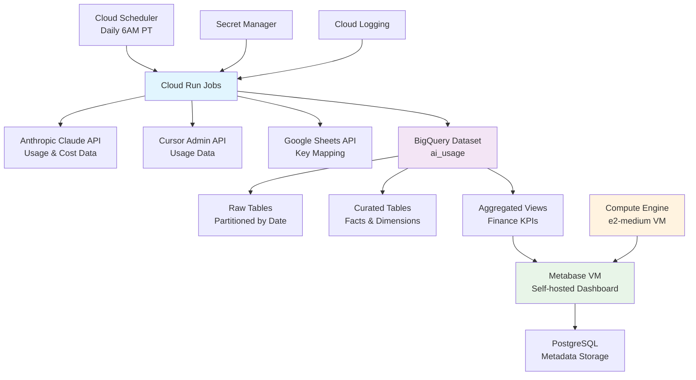
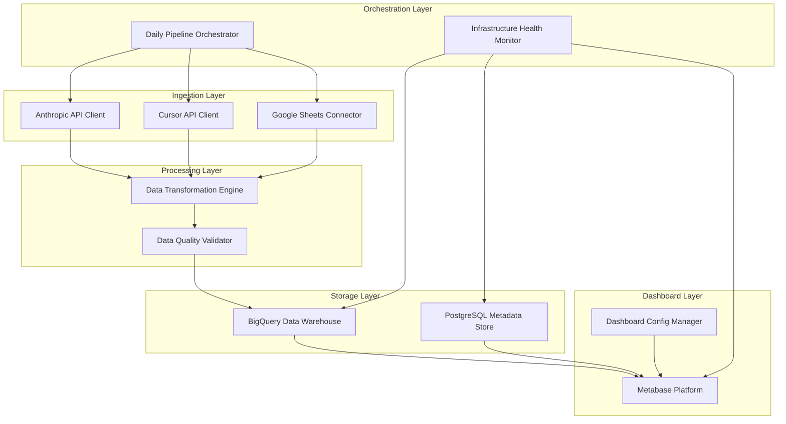
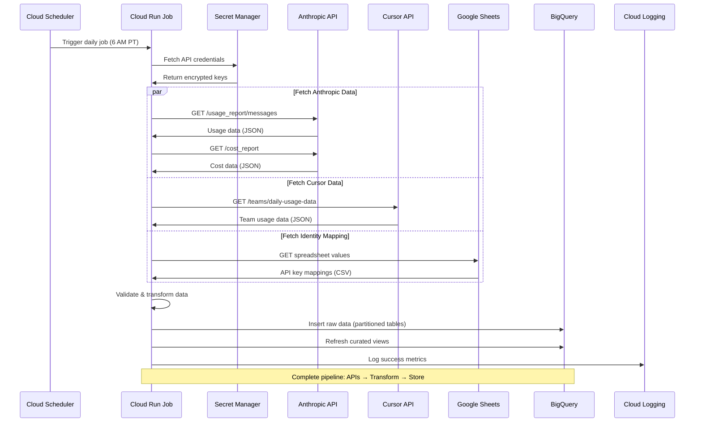
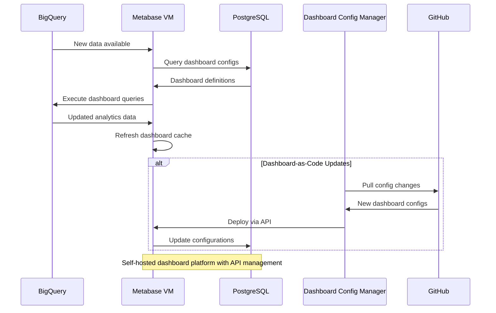

# AI Usage Analytics Dashboard Fullstack Architecture Document

**Project ID:** 03e62de8-5be5-4f58-a835-725ed7f7cab8
**Document Version:** 2.0
**Created:** September 26, 2025
**Author:** Winston (Architect)
**Status:** In Progress

---

## Introduction

This document outlines the complete fullstack architecture for **AI Usage Analytics Dashboard**, including backend systems, frontend implementation, and their integration. It serves as the single source of truth for AI-driven development, ensuring consistency across the entire technology stack.

This unified approach combines what would traditionally be separate backend and frontend architecture documents, streamlining the development process for modern fullstack applications where these concerns are increasingly intertwined.

### Starter Template or Existing Project

**Specialized Data Pipeline Project** - This is not a traditional fullstack application but rather a specialized serverless data analytics pipeline with dashboard visualization. The architecture is constrained by existing Google Cloud project (ai-workflows-459123) and optimized for daily batch processing with BigQuery data warehouse and self-hosted Metabase dashboards.

### Change Log
| Date | Version | Description | Author |
|------|---------|-------------|--------|
| September 27, 2025 | 1.0 | Initial architecture from PRD requirements | Winston (Architect) |
| September 26, 2025 | 2.0 | Updated for Metabase platform and fullstack template | Winston (Architect) |
| October 19, 2025 | 2.1 | Added Metabase chart automation components and source tree | Winston (Architect) |

---

## High Level Architecture

### Technical Summary

This system implements a hybrid serverless data analytics pipeline on Google Cloud Platform, orchestrating daily ingestion from Anthropic Claude API and Cursor API into a BigQuery data warehouse. The architecture leverages Cloud Run containerized Python services for scalable batch processing, Google Sheets for manual API key mapping, and self-hosted Metabase on GCP Compute Engine for finance-focused dashboards. The system prioritizes cost optimization through serverless compute for data processing, operational simplicity through managed services integration, and dashboard flexibility through self-hosted visualization platform with API-driven management capabilities.

### Platform and Infrastructure Choice

**Platform:** Google Cloud Platform (existing project: ai-workflows-459123)

**Key Services:**
- Cloud Run (containerized Python batch jobs)
- BigQuery (data warehouse with partitioned tables)
- Cloud Scheduler (daily 6 AM PT automation)
- Compute Engine (e2-medium VM for Metabase hosting)
- Secret Manager (API key storage with audit logging)
- Cloud Logging (structured JSON monitoring)
- Google Sheets API (manual identity mapping)
- PostgreSQL (Metabase metadata storage)

**Deployment Host and Regions:** US region for BigQuery compliance, Cloud Run multi-region for availability, VM in us-central1

### Repository Structure

**Structure:** Monorepo with data pipeline focus
**Monorepo Tool:** Python package structure with shared utilities
**Package Organization:**
- `/src/ingestion/` - API client modules per data source
- `/src/processing/` - BigQuery data transformation logic
- `/src/shared/` - Common utilities, config, and data models
- `/infrastructure/` - Cloud Run and VM deployment configs
- `/sql/` - BigQuery schema definitions and views
- `/metabase/` - Dashboard deployment and backup scripts

### High Level Architecture Diagram



### Architectural Patterns

- **Event-Driven Batch Processing:** Cloud Scheduler triggers containerized jobs for reliable daily execution - _Rationale:_ Cost-effective for daily batch requirements with built-in retry and monitoring
- **Data Lake + Data Warehouse:** Raw ingestion with curated analytics layers in BigQuery - _Rationale:_ Enables data quality validation while supporting both operational and analytical queries
- **API Gateway Pattern:** Centralized error handling and retry logic across all external APIs - _Rationale:_ Ensures consistent data quality and reliability across multiple data sources
- **Self-Hosted Dashboard Platform:** Metabase on dedicated VM with PostgreSQL metadata - _Rationale:_ Eliminates licensing costs while providing API-driven dashboard management and full control
- **Configuration as Code:** Infrastructure and schema definitions in version control - _Rationale:_ Enables reproducible deployments and change tracking for data pipeline reliability

---

## Tech Stack

### Technology Stack Table

| Category | Technology | Version | Purpose | Rationale |
|----------|------------|---------|---------|-----------|
| Backend Language | Python | 3.11+ | Data pipeline scripting | Excellent BigQuery/GCP integration, simple for data tasks |
| Data Processing | pandas | 2.0+ | Data transformation | Standard for data manipulation |
| Database | BigQuery | Latest | Data warehouse | Serverless, no maintenance, built for analytics |
| Metadata Storage | PostgreSQL | 15+ | Metabase configuration | Reliable metadata persistence for dashboard platform |
| Authentication | Google Cloud IAM | Latest | Service account auth | Native GCP integration |
| Backend Testing | pytest | 7.4+ | Unit tests | Simple testing framework |
| Build Tool | Docker | 24+ | Containerization | Required for Cloud Run |
| Container Orchestration | Docker Compose | 2.0+ | VM deployment | Simple multi-container orchestration for Metabase |
| CI/CD | GitHub Actions | Latest | Automated deployment | Simple, free deployment pipeline |
| Monitoring | Google Cloud Logging | Latest | Basic logging | Built-in monitoring, no extra tools needed |
| Secret Management | Google Secret Manager | Latest | API key storage | Secure, simple credential storage |
| Scheduling | Google Cloud Scheduler | Latest | Daily job automation | Managed cron service |
| Data Visualization | Metabase | 0.50+ | Self-hosted dashboards | Cost-effective, API-driven, no licensing fees |
| API Key Mapping | Google Sheets API | v4 | Manual identity resolution | Simple spreadsheet for 30-40 keys |
| VM Infrastructure | GCP Compute Engine | Latest | Metabase hosting platform | e2-medium instance for dashboard workload |
| Backup System | PostgreSQL pg_dump | 15+ | Metadata backup | Automated backup for dashboard configurations |
| Reverse Proxy | nginx | 1.24+ | HTTPS termination | SSL/TLS for secure dashboard access |
| Dashboard Automation | Metabase REST API | Latest | Programmatic chart creation | API-first for 13 chart types and 9 filter types |
| Configuration Validation | jsonschema + pydantic | 4.20+ / 2.5+ | Chart/filter config validation | Systematic configuration management |

---

## Data Models

### User

**Purpose:** Represents individual users across all AI platforms with unified identity resolution for cost allocation and productivity tracking.

**Key Attributes:**
- user_id: STRING - Unique identifier generated from email hash
- email: STRING - Primary identifier for user attribution across platforms
- first_name: STRING - User's first name for dashboard display
- last_name: STRING - User's last name for dashboard display
- department: STRING - Department for cost allocation reporting
- is_active: BOOLEAN - Current employment status for filtering
- created_at: TIMESTAMP - User record creation time
- updated_at: TIMESTAMP - Last modification timestamp

#### TypeScript Interface
```typescript
interface User {
  user_id: string;
  email: string;
  first_name: string;
  last_name: string;
  department: string;
  is_active: boolean;
  created_at: string; // ISO timestamp
  updated_at: string; // ISO timestamp
}
```

#### Relationships
- One user has many API key mappings (via email)
- One user has many usage records across platforms
- One user belongs to one department for cost allocation

### API Key Mapping

**Purpose:** Maps API keys to users for accurate cost attribution, maintained manually via Google Sheets integration.

**Key Attributes:**
- api_key_id: STRING - Unique API key identifier from vendor
- api_key_name: STRING - Human-readable name for identification
- email: STRING - Associated user email for attribution
- platform: STRING - AI platform (anthropic, cursor)
- purpose: STRING - Usage purpose (development, automation, etc.)
- is_active: BOOLEAN - Current key status

#### TypeScript Interface
```typescript
interface ApiKeyMapping {
  api_key_id: string;
  api_key_name: string;
  email: string;
  platform: 'anthropic' | 'cursor';
  purpose: string;
  is_active: boolean;
}
```

#### Relationships
- One API key belongs to one user (via email)
- One API key generates many usage records
- Many API keys can belong to one platform

### Daily Usage Fact

**Purpose:** Normalized daily usage metrics across all platforms for productivity analysis and cost allocation.

**Key Attributes:**
- usage_date: DATE - Date of usage activity
- platform: STRING - AI platform identifier
- user_email: STRING - User attribution
- api_key_id: STRING - Optional API key for attribution
- model: STRING - AI model used (claude-3, cursor-large, etc.)
- input_tokens: INTEGER - Input tokens consumed
- output_tokens: INTEGER - Output tokens generated
- requests: INTEGER - Number of API requests
- sessions: INTEGER - User session count
- loc_added: INTEGER - Lines of code added (development platforms)
- loc_accepted: INTEGER - Lines of code accepted (development platforms)
- acceptance_rate: FLOAT - Code acceptance percentage

#### TypeScript Interface
```typescript
interface DailyUsageFact {
  usage_date: string; // YYYY-MM-DD
  platform: string;
  user_email: string;
  api_key_id?: string;
  model: string;
  input_tokens: number;
  output_tokens: number;
  requests: number;
  sessions: number;
  loc_added: number;
  loc_accepted: number;
  acceptance_rate: number;
}
```

#### Relationships
- Links to User via user_email
- Links to ApiKeyMapping via api_key_id
- Aggregates to monthly cost summaries

### Daily Cost Fact

**Purpose:** Daily cost tracking by platform and user for financial reporting and budget management.

**Key Attributes:**
- cost_date: DATE - Date of cost incurrence
- platform: STRING - AI platform identifier
- workspace_id: STRING - Vendor workspace identifier
- api_key_id: STRING - API key for cost attribution
- cost_usd: FLOAT - Daily cost in USD
- cost_type: STRING - Type of cost (usage, subscription, overage)
- model: STRING - AI model driving costs

#### TypeScript Interface
```typescript
interface DailyCostFact {
  cost_date: string; // YYYY-MM-DD
  platform: string;
  workspace_id: string;
  api_key_id: string;
  cost_usd: number;
  cost_type: 'usage' | 'subscription' | 'overage';
  model: string;
}
```

#### Relationships
- Links to ApiKeyMapping via api_key_id for user attribution
- Aggregates to monthly financial summaries
- Correlates with DailyUsageFact for ROI analysis

---

## API Specification

Since this is a data pipeline rather than a traditional API-driven application, the "API" layer consists primarily of external integrations and the Metabase REST API for dashboard management.

### External API Integrations

#### Anthropic Claude API Integration

**Purpose:** Fetch usage and cost data for Claude API, Claude Code, and Claude.ai platforms

**Base URL:** `https://api.anthropic.com/v1`
**Authentication:** Admin API key with x-api-key header
**Rate Limits:** Exponential backoff strategy for 429 responses

**Key Endpoints Used:**
- `GET /organizations/usage_report/messages` - Daily usage data with token counts and model usage
- `GET /organizations/cost_report` - Daily cost breakdown by workspace

**Request/Response Schema:**
```typescript
// Usage Report Request
interface UsageReportRequest {
  start_date: string; // YYYY-MM-DD
  end_date: string;   // YYYY-MM-DD
}

// Usage Report Response
interface UsageReportResponse {
  data: Array<{
    api_key_id: string;
    workspace_id: string;
    model: string;
    uncached_input_tokens: number;
    output_tokens: number;
    cache_read_input_tokens: number;
    cache_creation_tokens: number;
    service_tier: string;
    context_window: string;
    starting_at: string; // ISO timestamp
    ending_at: string;   // ISO timestamp
  }>;
}

// Cost Report Response
interface CostReportResponse {
  data: Array<{
    workspace_id: string;
    api_key_id: string;
    cost_usd: number;
    cost_date: string; // YYYY-MM-DD
    model: string;
  }>;
}
```

#### Cursor Admin API Integration

**Purpose:** Fetch team usage data including lines of code and productivity metrics

**Base URL:** `https://api.cursor.com`
**Authentication:** Bearer token in Authorization header
**Rate Limits:** 90-day maximum date range per request

**Key Endpoints Used:**
- `GET /teams/daily-usage-data` - Daily team usage with developer attribution and code metrics

**Request/Response Schema:**
```typescript
// Daily Usage Request
interface CursorUsageRequest {
  start_date: string; // YYYY-MM-DD
  end_date: string;   // YYYY-MM-DD
}

// Daily Usage Response
interface CursorUsageResponse {
  data: Array<{
    email: string;
    usage_date: number; // Unix timestamp
    total_lines_added: number;
    accepted_lines_added: number;
    total_accepts: number;
    total_rejects: number;
    subscription_included_reqs: number;
    usage_based_reqs: number;
    most_used_model: string;
    client_version: string;
  }>;
}
```

#### Metabase Management API

**Purpose:** Programmatic dashboard management and configuration

**Base URL:** `https://metabase-vm.internal/api`
**Authentication:** Session token or API key
**Rate Limits:** Standard web application limits

**Key Endpoints Used:**
- `POST /api/session` - Authentication and session management
- `GET /api/dashboard` - List available dashboards
- `POST /api/dashboard` - Create new dashboard
- `PUT /api/dashboard/{id}` - Update dashboard configuration
- `GET /api/card` - List dashboard cards/widgets
- `POST /api/card` - Create new dashboard widget

**Request/Response Schema:**
```typescript
// Dashboard Creation Request
interface CreateDashboardRequest {
  name: string;
  description?: string;
  collection_id?: number;
  parameters?: Array<{
    name: string;
    type: string;
    default?: any;
  }>;
}

// Dashboard Response
interface DashboardResponse {
  id: number;
  name: string;
  description: string;
  created_at: string;
  updated_at: string;
  collection_id: number;
  parameters: Array<{
    id: string;
    name: string;
    type: string;
    default: any;
  }>;
}
```

---

## Components

### Data Ingestion Components

#### Anthropic API Client
**Responsibility:** Fetch usage and cost data from Anthropic Claude APIs with robust error handling and retry logic

**Key Interfaces:**
- `fetch_daily_usage(date: str) -> Dict` - Get usage data for specific date
- `fetch_daily_costs(date: str) -> Dict` - Get cost breakdown for date range
- `validate_response(data: Dict) -> bool` - Schema validation before processing

**Dependencies:** Secret Manager (API keys), Cloud Logging (error tracking)

**Technology Stack:** Python requests library, exponential backoff, JSON schema validation

#### Cursor API Client
**Responsibility:** Extract team usage data including developer productivity metrics and code acceptance rates

**Key Interfaces:**
- `fetch_team_usage(start_date: str, end_date: str) -> List[Dict]` - Team usage data with date range
- `normalize_timestamps(data: List[Dict]) -> List[Dict]` - Convert Unix timestamps to ISO format
- `validate_email_attribution(data: List[Dict]) -> List[Dict]` - Ensure email format consistency

**Dependencies:** Secret Manager (API keys), Cloud Logging (audit trail)

**Technology Stack:** Python requests, date/time utilities, email validation

#### Google Sheets Connector
**Responsibility:** Fetch manual API key to user email mappings for cost attribution

**Key Interfaces:**
- `fetch_key_mappings() -> List[Dict]` - Retrieve current API key mappings
- `validate_mapping_data(data: List[Dict]) -> List[Dict]` - Ensure data quality
- `detect_mapping_changes() -> bool` - Track mapping updates for audit

**Dependencies:** Google Sheets API, service account authentication

**Technology Stack:** Google Sheets API client, CSV parsing, data validation

### Data Processing Components

#### Data Transformation Engine
**Responsibility:** Normalize raw API data into consistent fact table format across all platforms

**Key Interfaces:**
- `transform_anthropic_usage(raw_data: Dict) -> List[Dict]` - Usage fact normalization
- `transform_cursor_metrics(raw_data: List[Dict]) -> List[Dict]` - Productivity metric processing
- `apply_user_attribution(facts: List[Dict], mappings: List[Dict]) -> List[Dict]` - Cost allocation logic

**Dependencies:** dim_api_keys, dim_users tables for lookups

**Technology Stack:** Python pandas for data manipulation, custom transformation logic

#### Data Quality Validator
**Responsibility:** Ensure data integrity and business rule compliance before BigQuery storage

**Key Interfaces:**
- `validate_schema_compliance(data: List[Dict], schema: Dict) -> ValidationResult` - Schema validation
- `check_business_rules(data: List[Dict]) -> ValidationResult` - Business logic validation
- `detect_anomalies(data: List[Dict]) -> List[Anomaly]` - Statistical anomaly detection

**Dependencies:** Predefined schema definitions, historical data for anomaly detection

**Technology Stack:** JSON schema validation, pandas for statistical analysis

### Data Storage Components

#### BigQuery Data Warehouse
**Responsibility:** Scalable analytics storage with partitioned tables optimized for time-series analysis

**Key Interfaces:**
- `load_raw_data(table: str, data: List[Dict])` - Bulk insert with partition management
- `refresh_curated_views()` - Update aggregated reporting views
- `execute_quality_checks() -> Dict` - Run automated data quality queries

**Dependencies:** Google Cloud IAM for access control, Cloud Logging for audit

**Technology Stack:** BigQuery Python client, SQL for view definitions, partitioning/clustering optimization

#### PostgreSQL Metadata Store
**Responsibility:** Reliable storage for Metabase configuration and dashboard definitions

**Key Interfaces:**
- `backup_metadata() -> BackupResult` - Automated PostgreSQL backup
- `restore_from_backup(backup_id: str) -> RestoreResult` - Disaster recovery
- `monitor_connections() -> HealthStatus` - Connection pool monitoring

**Dependencies:** GCP Compute Engine VM, automated backup scheduling

**Technology Stack:** PostgreSQL 15+, pg_dump for backups, connection pooling

### Dashboard Platform Components

#### Metabase Dashboard Platform
**Responsibility:** Self-hosted business intelligence platform providing all 6 dashboard types with API-driven management

**Key Interfaces:**
- `deploy_dashboard(config: Dict) -> bool` - Programmatic dashboard deployment
- `backup_metadata() -> BackupResult` - PostgreSQL backup automation
- `health_check() -> ServiceStatus` - VM and service health monitoring

**Dependencies:** GCP Compute Engine VM, PostgreSQL metadata database, BigQuery data source

**Technology Stack:** Docker Compose, Metabase OSS, PostgreSQL, nginx reverse proxy

#### Dashboard Configuration Manager
**Responsibility:** Version-controlled dashboard-as-code deployment and management

**Key Interfaces:**
- `deploy_dashboard_from_config(dashboard_def: Dict) -> DeployResult` - Deploy from version control
- `export_dashboard_config(dashboard_id: int) -> Dict` - Export for version control
- `validate_dashboard_config(config: Dict) -> ValidationResult` - Pre-deployment validation

**Dependencies:** Metabase REST API, Git repository for configuration storage

**Technology Stack:** Python Metabase API client, YAML configuration parsing

#### Metabase Chart Automation System (NEW - Oct 2025)
**Responsibility:** Claude-assisted creation of all chart types (13) and filter types (9) via enhanced create_dashboards.py script

**Key Interfaces:**
- `create_card(display_type, viz_settings)` - Create chart with specific type and visualization settings
- `create_dimension_parameter(table, column, widget_type)` - Create field filter with dropdown/search/date widgets
- `load_chart_config(config_file)` - Load chart type mappings from chart_config.json
- `resolve_field_id(table, column)` - Resolve BigQuery field IDs for field filter parameters

**Dependencies:** Metabase REST API, BigQuery metadata API, chart_templates.py, filter_templates.py, config_loader.py

**Technology Stack:** Python requests, JSON configuration management, field filter API integration

**Chart Types Supported:** scalar (KPIs), line (trends), bar (comparisons), pie (breakdowns), gauge (progress), combo (dual-axis), area (cumulative), row (horizontal bars), scatter (correlation), funnel (conversion), waterfall (sequential), pivot (multi-dimensional), table (detailed data)

**Filter Types Supported:** Field filters (dropdown, multi-select, search, date range, relative date, number range), Static filters (date, number, text)

### Orchestration Components

#### Daily Pipeline Orchestrator
**Responsibility:** Coordinate daily data ingestion workflow with error handling and monitoring

**Key Interfaces:**
- `execute_daily_pipeline(date: str) -> PipelineResult` - Main orchestration entry point
- `handle_pipeline_failure(error: Exception) -> RecoveryAction` - Error recovery logic
- `generate_pipeline_report() -> Dict` - Daily execution summary

**Dependencies:** All ingestion and processing components, Cloud Logging

**Technology Stack:** Python asyncio for parallel execution, structured error handling

#### Infrastructure Health Monitor
**Responsibility:** Monitor system health across Cloud Run, BigQuery, and VM infrastructure

**Key Interfaces:**
- `check_service_health() -> HealthReport` - Overall system health status
- `monitor_vm_resources() -> ResourceStatus` - VM CPU/memory/disk monitoring
- `validate_data_freshness() -> FreshnessReport` - Data pipeline health validation

**Dependencies:** GCP monitoring APIs, Metabase health endpoints

**Technology Stack:** Google Cloud Monitoring client, custom health check logic

### Component Diagrams



---

## Core Workflows

### Daily Data Ingestion Workflow



### Metabase Dashboard Update Workflow



---

## Database Schema

### BigQuery Dataset Configuration
- **Dataset Name:** `ai_usage`
- **Location:** `US` (multi-region for availability)
- **Default Table Expiration:** None (2+ year retention requirement)
- **Encryption:** Google-managed keys

### Raw Data Tables (Ingestion Layer)

#### raw_anthropic_usage
```sql
CREATE TABLE `ai_usage.raw_anthropic_usage` (
  ingest_date DATE NOT NULL,
  fetched_at TIMESTAMP NOT NULL,
  api_key_id STRING NOT NULL,
  workspace_id STRING NOT NULL,
  model STRING NOT NULL,
  uncached_input_tokens INT64,
  output_tokens INT64,
  cache_read_input_tokens INT64,
  cache_creation_tokens INT64,
  service_tier STRING,
  context_window STRING,
  starting_at TIMESTAMP NOT NULL,
  ending_at TIMESTAMP NOT NULL
)
PARTITION BY ingest_date
CLUSTER BY api_key_id, model;
```

#### raw_cursor_usage
```sql
CREATE TABLE `ai_usage.raw_cursor_usage` (
  ingest_date DATE NOT NULL,
  fetched_at TIMESTAMP NOT NULL,
  email STRING NOT NULL,
  usage_date DATE NOT NULL,
  total_lines_added INT64,
  accepted_lines_added INT64,
  total_accepts INT64,
  total_rejects INT64,
  subscription_included_reqs INT64,
  usage_based_reqs INT64,
  most_used_model STRING,
  client_version STRING
)
PARTITION BY ingest_date
CLUSTER BY email, usage_date;
```

### Curated Data Tables (Analytics Layer)

#### fct_usage_daily
```sql
CREATE TABLE `ai_usage.fct_usage_daily` (
  usage_date DATE NOT NULL,
  platform STRING NOT NULL,
  user_email STRING NOT NULL,
  api_key_id STRING,
  model STRING NOT NULL,
  input_tokens INT64 DEFAULT 0,
  output_tokens INT64 DEFAULT 0,
  requests INT64 DEFAULT 0,
  sessions INT64 DEFAULT 0,
  loc_added INT64 DEFAULT 0,
  loc_accepted INT64 DEFAULT 0,
  acceptance_rate NUMERIC(5,4) DEFAULT 0,
  processed_at TIMESTAMP DEFAULT CURRENT_TIMESTAMP()
)
PARTITION BY usage_date
CLUSTER BY platform, user_email;
```

#### fct_cost_daily
```sql
CREATE TABLE `ai_usage.fct_cost_daily` (
  cost_date DATE NOT NULL,
  platform STRING NOT NULL,
  workspace_id STRING,
  api_key_id STRING,
  user_email STRING,
  cost_usd NUMERIC(10,4) NOT NULL,
  cost_type STRING DEFAULT 'usage',
  model STRING,
  processed_at TIMESTAMP DEFAULT CURRENT_TIMESTAMP()
)
PARTITION BY cost_date
CLUSTER BY platform, user_email;
```

---

## Unified Project Structure

```plaintext
samba-ai-usage-stats/
├── .github/                           # CI/CD workflows
│   └── workflows/
│       ├── ci.yaml                    # Testing and validation
│       └── deploy.yaml                # Cloud Run deployment
├── src/                               # Python application code
│   ├── ingestion/                     # API client modules
│   │   ├── __init__.py
│   │   ├── anthropic_client.py        # Anthropic API integration
│   │   ├── cursor_client.py           # Cursor API integration
│   │   └── sheets_client.py           # Google Sheets connector
│   ├── processing/                    # Data transformation logic
│   │   ├── __init__.py
│   │   ├── transformer.py             # Raw data normalization
│   │   ├── validator.py               # Data quality checks
│   │   └── attribution.py            # User attribution logic
│   ├── storage/                       # BigQuery interaction
│   │   ├── __init__.py
│   │   ├── bigquery_client.py         # BigQuery operations
│   │   └── schema_manager.py          # Table creation/updates
│   ├── shared/                        # Common utilities
│   │   ├── __init__.py
│   │   ├── config.py                  # Configuration management
│   │   ├── logging_setup.py           # Structured logging
│   │   ├── models.py                  # Data models/types
│   │   └── utils.py                   # Helper functions
│   ├── orchestration/                 # Workflow coordination
│   │   ├── __init__.py
│   │   ├── daily_job.py               # Main pipeline orchestrator
│   │   └── health_check.py            # Health monitoring
│   └── main.py                        # Cloud Run entry point
├── sql/                               # BigQuery schema definitions
│   ├── tables/                        # Table creation scripts
│   │   ├── raw_tables.sql
│   │   ├── curated_tables.sql
│   │   └── dimension_tables.sql
│   ├── views/                         # Analytics views
│   │   ├── monthly_finance.sql
│   │   ├── productivity_metrics.sql
│   │   └── cost_allocation.sql
│   └── migrations/                    # Schema migration scripts
│       └── 001_initial_schema.sql
├── scripts/metabase/                  # Metabase automation scripts
│   ├── create_dashboards.py          # Dashboard creation (enhanced for charts/filters)
│   ├── create_single_card.py         # Single card creation
│   ├── chart_templates.py            # Chart visualization templates (NEW - Oct 2025)
│   ├── filter_templates.py           # Filter configuration templates (NEW - Oct 2025)
│   ├── config_loader.py              # Configuration loader (NEW - Oct 2025)
│   ├── validate_config.py            # Config validation (NEW - Oct 2025)
│   ├── chart_config.json             # Chart type mappings (NEW - Oct 2025)
│   ├── filter_config.json            # Filter presets (NEW - Oct 2025)
│   ├── run_dashboard_creation.sh     # Automation wrapper
│   └── setup_bigquery_connection.sh  # BigQuery connection setup
├── infrastructure/metabase/           # Metabase VM deployment
│   ├── docker-compose.yml             # Metabase + PostgreSQL
│   ├── metabase.env.example           # Environment template
│   ├── backup-metabase.sh             # Backup automation
│   ├── startup.sh                     # VM startup script
│   └── README.md
├── examples/                          # Example configurations (NEW - Oct 2025)
│   └── chart_configs/
│       ├── example_line_chart.json
│       ├── example_pie_chart.json
│       ├── example_multi_chart.json
│       └── example_with_filters.json
├── infrastructure/                    # Deployment configurations
│   ├── cloud_run/
│   │   ├── service.yaml               # Cloud Run service definition
│   │   └── job.yaml                   # Cloud Run job definition
│   ├── compute_engine/
│   │   ├── vm-startup.sh              # VM initialization
│   │   ├── firewall-rules.yaml        # Security configuration
│   │   └── vm-config.yaml             # VM specifications
│   └── terraform/                     # Infrastructure as Code
│       ├── main.tf
│       ├── variables.tf
│       └── metabase-vm.tf
├── tests/                             # Test suite
│   ├── unit/                          # Unit tests
│   ├── integration/                   # Integration tests
│   └── fixtures/                      # Test data
├── scripts/                           # Utility scripts
│   ├── setup_local_env.sh             # Local development setup
│   ├── deploy.sh                      # Deployment helper
│   └── backfill_data.py               # Historical data loading
├── docs/                              # Documentation
│   ├── prd.md                         # Product requirements
│   ├── architecture.md                # This document
│   └── runbook.md                     # Operations guide
├── .env.example                       # Environment variables template
├── Dockerfile                         # Container definition
├── requirements.txt                   # Python dependencies
└── README.md                          # Project overview
```

---

## Development Workflow

### Local Development Setup

#### Prerequisites
```bash
# Install required tools
python3.11 -m pip install --upgrade pip
pip install -r requirements.txt

# Install Google Cloud CLI
curl https://sdk.cloud.google.com | bash
gcloud auth login
gcloud config set project ai-workflows-459123

# Docker for containerization
docker --version  # Ensure Docker installed
```

#### Initial Setup
```bash
# Clone and setup repository
git clone https://github.com/your-org/samba-ai-usage-stats.git
cd samba-ai-usage-stats

# Setup virtual environment
python3.11 -m venv venv
source venv/bin/activate  # Linux/Mac

# Install dependencies
pip install -r requirements.txt

# Copy environment template
cp .env.example .env
# Edit .env with your local configuration

# Setup BigQuery dataset (development)
./scripts/setup_local_env.sh
```

#### Development Commands
```bash
# Start local development (mock mode)
python src/main.py --mode=development --mock-apis=true

# Run with real APIs (requires credentials)
python src/main.py --mode=development

# Run data pipeline for specific date
python src/main.py --date=2025-09-26

# Start Metabase locally
cd metabase && docker-compose up -d

# Run tests
pytest tests/unit/
pytest tests/integration/ --slow
```

### Environment Configuration

#### Required Environment Variables
```bash
# Data Pipeline (.env)
GOOGLE_CLOUD_PROJECT=ai-workflows-459123
BIGQUERY_DATASET=ai_usage_dev
ANTHROPIC_ADMIN_KEY_SECRET=projects/ai-workflows-459123/secrets/anthropic-admin-key
CURSOR_API_KEY_SECRET=projects/ai-workflows-459123/secrets/cursor-api-key
GOOGLE_SHEETS_ID=your-sheets-id-here
LOG_LEVEL=INFO
ENVIRONMENT=development

# Metabase (.env.metabase)
MB_DB_TYPE=postgres
MB_DB_DBNAME=metabase
MB_DB_PORT=5432
MB_DB_USER=metabase
MB_DB_PASS=secure-password
MB_ENCRYPTION_SECRET_KEY=your-secret-key

# Shared
PROJECT_ID=ai-workflows-459123
REGION=us-central1
```

---

## Deployment Architecture

### Deployment Strategy

**Data Pipeline Deployment:**
- **Platform:** Google Cloud Run (serverless containers)
- **Build Command:** `docker build -t gcr.io/ai-workflows-459123/ai-usage-ingestion .`
- **Deployment Method:** Automated via GitHub Actions with Cloud Build
- **Scheduling:** Cloud Scheduler triggers daily at 6 AM PT

**Metabase Deployment:**
- **Platform:** GCP Compute Engine e2-medium VM
- **Build Command:** `docker-compose up -d`
- **Deployment Method:** VM startup script with Docker Compose
- **Access:** HTTPS via nginx reverse proxy with Let's Encrypt SSL

### Environments
| Environment | Data Pipeline | Metabase URL | Purpose |
|-------------|---------------|--------------|---------|
| Development | Local container | http://localhost:3000 | Local development |
| Staging | `ai-usage-pipeline-staging` | https://metabase-staging.internal | Pre-production testing |
| Production | `ai-usage-pipeline` | https://metabase-prod.internal | Live environment |

---

## Security and Performance

### Security Requirements

**Data Pipeline Security:**
- **API Security:** All API keys stored in Google Secret Manager with audit logging
- **Access Control:** Service accounts with principle of least privilege
- **Network Security:** Cloud Run with no public access, scheduler-triggered only
- **Data Encryption:** TLS 1.2+ in transit, Google-managed keys at rest

**Metabase VM Security:**
- **Firewall Rules:** Port 80/443 only, SSH restricted to specific IPs
- **SSL/TLS:** Let's Encrypt certificates for HTTPS dashboard access
- **Database Security:** PostgreSQL with role-based access control
- **API Security:** Metabase API tokens with rotation policy

### Performance Optimization

**Data Pipeline Performance:**
- **Parallel Processing:** Concurrent API calls reduce total execution time from ~15 minutes to ~5 minutes
- **Batch Size Optimization:** 1000-record batches for BigQuery streaming inserts
- **Query Optimization:** Partitioned tables reduce scan costs by 80-90%

**Metabase Performance:**
- **VM Sizing:** e2-medium instance provides sufficient resources for dashboard workload
- **Query Performance:** Dashboard queries complete within 5 seconds leveraging BigQuery optimizations
- **Caching Strategy:** Metabase native caching for frequently accessed dashboards

---

## Monitoring and Observability

### Monitoring Stack
- **Infrastructure Monitoring:** Google Cloud Monitoring (native GCP integration)
- **Application Logging:** Google Cloud Logging with structured JSON format
- **VM Monitoring:** GCP Compute Engine monitoring for Metabase VM
- **Dashboard Monitoring:** Metabase health endpoints and query performance

### Key Metrics

**Pipeline Metrics:**
- Daily job success rate (target: >99%)
- API response times (target: <30 seconds per call)
- BigQuery load times (target: <2 minutes total)
- Data freshness (alert if >25 hours old)

**VM Metrics:**
- VM uptime and availability (target: >99.5%)
- PostgreSQL connection health
- Metabase service availability
- Dashboard query response times (target: <5 seconds)

**Business Metrics:**
- Records processed per day
- Cost data accuracy (variance from expected ranges)
- User attribution completeness (target: >95%)
- Cross-platform data consistency

---

*Generated by Winston (Architect) using BMAD-METHOD™ framework*
