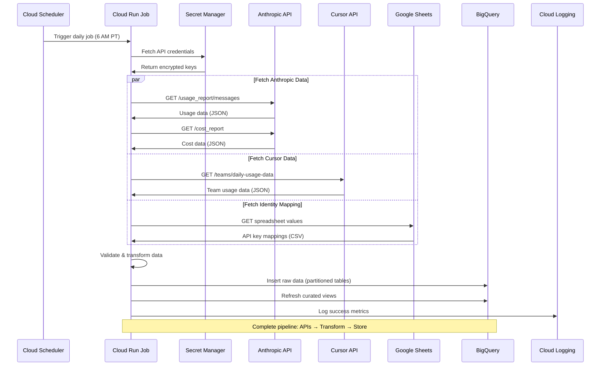
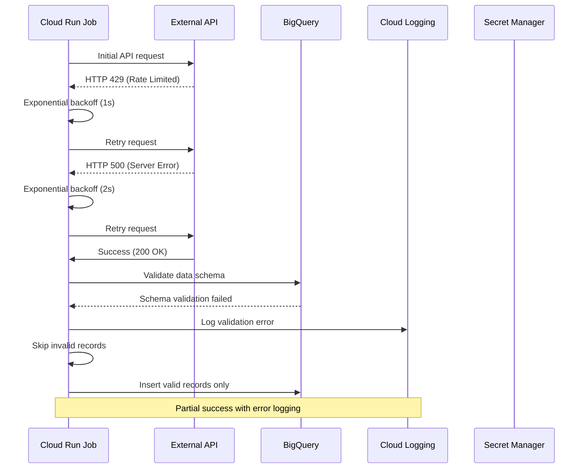

# Core Workflows

## Daily Data Ingestion Workflow

```mermaid
sequenceDiagram
    participant CS as Cloud Scheduler
    participant CR as Cloud Run Job
    participant SM as Secret Manager
    participant AA as Anthropic API
    participant CA as Cursor API
    participant GS as Google Sheets
    participant BQ as BigQuery
    participant CL as Cloud Logging

    CS->>CR: Trigger daily job (6 AM PT)
    CR->>SM: Fetch API credentials
    SM->>CR: Return encrypted keys

    par Fetch Anthropic Data
        CR->>AA: GET /usage_report/messages
        AA->>CR: Usage data (JSON)
        CR->>AA: GET /cost_report
        AA->>CR: Cost data (JSON)
    and Fetch Cursor Data
        CR->>CA: GET /teams/daily-usage-data
        CA->>CR: Team usage data (JSON)
    and Fetch Identity Mapping
        CR->>GS: GET spreadsheet values
        GS->>CR: API key mappings (CSV)
    end

    CR->>CR: Validate & transform data
    CR->>BQ: Insert raw data (partitioned tables)
    CR->>BQ: Refresh curated views
    CR->>CL: Log success metrics

    Note over CR,BQ: Complete pipeline: APIs → Transform → Store
```

## Error Handling and Retry Workflow

```mermaid
sequenceDiagram
    participant CR as Cloud Run Job
    participant API as External API
    participant BQ as BigQuery
    participant CL as Cloud Logging
    participant SM as Secret Manager

    CR->>API: Initial API request
    API-->>CR: HTTP 429 (Rate Limited)

    CR->>CR: Exponential backoff (1s)
    CR->>API: Retry request #1
    API-->>CR: HTTP 500 (Server Error)

    CR->>CR: Exponential backoff (2s)
    CR->>API: Retry request #2
    API->>CR: Success (200 OK)

    CR->>BQ: Validate data schema
    BQ-->>CR: Schema validation failed

    CR->>CL: Log validation error
    CR->>CR: Skip invalid records
    CR->>BQ: Insert valid records only

    Note over CR,CL: Partial success with error logging
```

---
