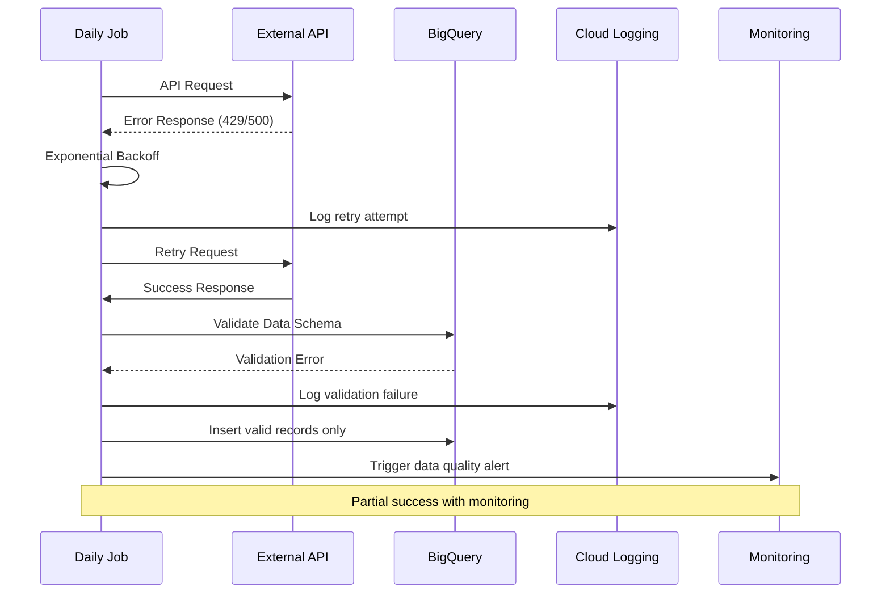

# Error Handling Strategy

## Error Flow Diagram


## Error Response Format
```python
@dataclass
class PipelineError:
    error_code: str
    message: str
    component: str
    timestamp: str
    request_id: str
    details: Optional[Dict[str, Any]] = None

    def to_log_entry(self) -> Dict:
        return {
            "severity": "ERROR",
            "error_code": self.error_code,
            "message": self.message,
            "component": self.component,
            "timestamp": self.timestamp,
            "request_id": self.request_id,
            "details": self.details
        }
```

## Data Pipeline Error Handling
```python
# src/shared/error_handler.py
class PipelineErrorHandler:
    def handle_api_error(self, error: Exception, api_name: str, retry_count: int):
        if retry_count >= 3:
            self.log_critical_failure(error, api_name)
            return False  # Stop retrying

        backoff_seconds = 2 ** retry_count
        self.log_retry_attempt(error, api_name, backoff_seconds)
        time.sleep(backoff_seconds)
        return True  # Continue retrying

    def handle_data_quality_error(self, validation_result: ValidationResult):
        if validation_result.critical_errors:
            self.log_critical_data_issue(validation_result)
            raise DataQualityException("Critical data quality failure")

        if validation_result.warnings:
            self.log_data_warnings(validation_result)
            # Continue processing with warnings
```

---
