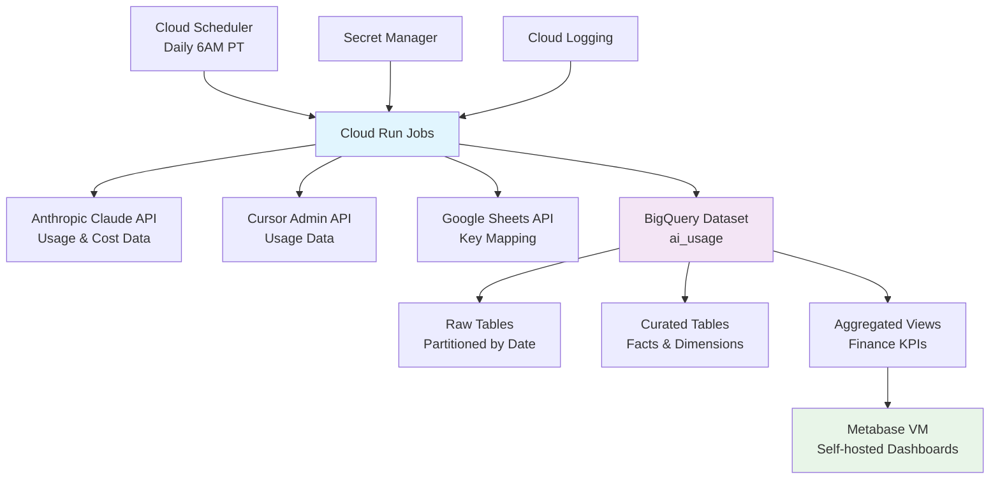

# High Level Architecture

## Technical Summary

This system implements a serverless data analytics pipeline on Google Cloud Platform, orchestrating daily ingestion from Anthropic Claude API and Cursor API into a BigQuery data warehouse. The architecture leverages Cloud Run containerized Python services for scalable batch processing, with Google Sheets providing manual API key mapping and self-hosted Metabase delivering finance-focused dashboards. The system prioritizes cost optimization through serverless compute, data quality through automated validation, and operational simplicity through managed services integration.

## Platform and Infrastructure Choice

**Platform:** Google Cloud Platform (existing project: ai-workflows-459123)
**Key Services:**
- Cloud Run (containerized Python batch jobs)
- BigQuery (data warehouse with partitioned tables)
- Cloud Scheduler (daily 6 AM PT automation)
- Secret Manager (API key storage with audit logging)
- Cloud Logging (structured JSON monitoring)
- Google Sheets API (manual identity mapping)
- Metabase (self-hosted dashboard visualization)
- GCP Compute Engine (VM hosting for Metabase)
- PostgreSQL (Metabase metadata storage)

**Deployment Host and Regions:** US region for BigQuery compliance, Cloud Run multi-region for availability

## Repository Structure

**Structure:** Monorepo with data pipeline focus
**Monorepo Tool:** Python package structure with shared utilities
**Package Organization:**
- `/src/ingestion/` - API client modules per data source
- `/src/processing/` - BigQuery data transformation logic
- `/src/shared/` - Common utilities, config, and data models
- `/infrastructure/` - Cloud Run deployment configs
- `/sql/` - BigQuery schema definitions and views

## High Level Architecture Diagram

## Architectural Patterns

- **Event-Driven Batch Processing:** Cloud Scheduler triggers containerized jobs for reliable daily execution - _Rationale:_ Cost-effective for daily batch requirements with built-in retry and monitoring
- **Data Lake + Data Warehouse:** Raw ingestion with curated analytics layers in BigQuery - _Rationale:_ Enables data quality validation while supporting both operational and analytical queries
- **API Gateway Pattern:** Centralized error handling and retry logic across all external APIs - _Rationale:_ Ensures consistent data quality and reliability across multiple data sources
- **Configuration as Code:** Infrastructure and schema definitions in version control - _Rationale:_ Enables reproducible deployments and change tracking for data pipeline reliability

---
